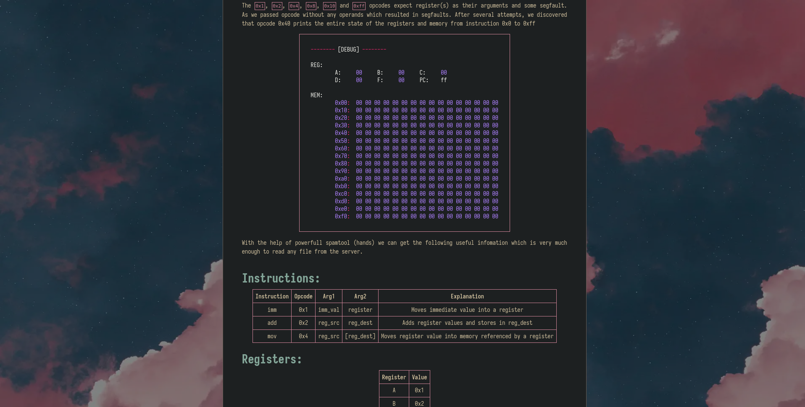

# Sad Theme

Be Happy.

## Showcase
### Home

### Post





## Hugo environment
```
hugo v0.124.1-db083b05f16c945fec04f745f0ca8640560cf1ec linux/amd64 BuildDate=2024-03-20T11:40:10Z VendorInfo=gohugoio
GOOS="linux"
GOARCH="amd64"
GOVERSION="go1.22.1"
```

## Installation

```sh
hugo new site test
cd test
git clone https://github.com/terawhiz/sad-theme.git ./themes/sad-theme
echo "theme = 'sad-theme'" > hugo.toml
hugo server
```


Todo:
- [ ] Design tags
- [ ] Setup seo and probably a nice embed